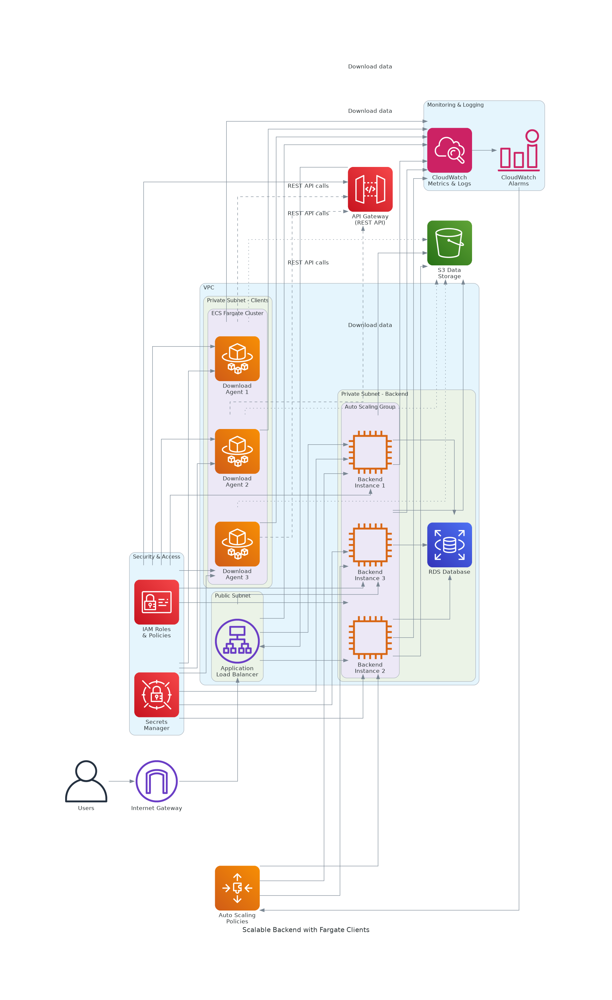

# Scalable Backend Architecture with Fargate Clients

This project implements a scalable backend service architecture using AWS CDK with the following components:

## Architecture Overview



### Components

1. **Application Load Balancer (ALB)**: Distributes incoming traffic across multiple backend instances
2. **Auto Scaling Group**: Automatically scales EC2 instances based on demand
3. **Backend Instances**: EC2 instances running the backend service
4. **RDS Database**: PostgreSQL database for persistent data storage
5. **ECS Fargate Cluster**: Runs download agent containers
6. **API Gateway**: Provides REST API endpoints for client access
7. **S3 Bucket**: Stores data files for download
8. **CloudWatch**: Monitoring and logging
9. **IAM**: Security and access management
10. **Secrets Manager**: Secure storage of database credentials

### Key Features

- **High Availability**: Multi-AZ deployment with redundancy
- **Auto Scaling**: Automatic scaling based on CPU utilization
- **Security**: Private subnets, security groups, and IAM roles
- **Monitoring**: CloudWatch metrics, alarms, and dashboards
- **Serverless Clients**: Fargate-based download agents
- **API Access**: REST API through API Gateway
- **Data Storage**: S3 for file storage, RDS for structured data

## Prerequisites

- AWS CLI configured with appropriate permissions
- Node.js 18+ installed
- AWS CDK CLI installed (`npm install -g aws-cdk`)
- Docker installed (for local testing)

## Deployment Instructions

### 1. Install Dependencies

```bash
npm install
```

### 2. Bootstrap CDK (if not done before)

```bash
cdk bootstrap
```

### 3. Deploy the Stack

```bash
# Build the TypeScript code
npm run build

# Deploy the stack
cdk deploy
```

### 4. Verify Deployment

After deployment, you'll see outputs including:
- Load Balancer DNS name
- API Gateway URL
- S3 bucket name
- Database endpoint

## Architecture Details

### Network Architecture

- **VPC**: Custom VPC with public and private subnets across multiple AZs
- **Public Subnet**: Contains the Application Load Balancer
- **Private Subnets**: 
  - Backend subnet for EC2 instances and RDS
  - Client subnet for Fargate tasks
- **NAT Gateways**: Enable internet access for private subnets

### Security

- **Security Groups**: Restrict traffic between components
- **IAM Roles**: Least privilege access for all components
- **Secrets Manager**: Secure database credential storage
- **Encryption**: S3 and RDS encryption at rest

### Monitoring and Scaling

- **CloudWatch Metrics**: CPU, memory, and custom application metrics
- **Auto Scaling Policies**: Scale up/down based on CPU utilization
- **CloudWatch Alarms**: Alert on high CPU usage
- **Dashboard**: Centralized monitoring view

### Data Flow

1. **User Requests**: Users access the system through the ALB
2. **Load Balancing**: ALB distributes requests to healthy backend instances
3. **Backend Processing**: EC2 instances process requests and interact with RDS
4. **Data Storage**: Files stored in S3, structured data in RDS
5. **Client Access**: Fargate clients pull data via REST API
6. **Monitoring**: All components send metrics to CloudWatch

## Customization

### Backend Application

Replace the sample Docker container in the user data script with your actual application:

```bash
# In scalable-backend-stack.ts, update the userData section
docker run -d -p 8080:8080 --name backend-app your-app:latest
```

### Fargate Client Application

Update the container image and command in the task definition:

```typescript
const container = taskDefinition.addContainer('DownloadAgentContainer', {
  image: ecs.ContainerImage.fromRegistry('your-download-agent:latest'),
  // Add your application configuration
});
```

### Scaling Configuration

Adjust auto scaling parameters:

```typescript
const autoScalingGroup = new autoscaling.AutoScalingGroup(this, 'BackendAutoScalingGroup', {
  minCapacity: 2,    // Minimum instances
  maxCapacity: 20,   // Maximum instances
  desiredCapacity: 5, // Initial instances
});
```

### Database Configuration

For production, enable Multi-AZ and adjust instance size:

```typescript
const database = new rds.DatabaseInstance(this, 'Database', {
  instanceType: ec2.InstanceType.of(ec2.InstanceClass.T3, ec2.InstanceSize.MEDIUM),
  multiAz: true,
  deletionProtection: true,
});
```

## Cost Optimization

- Use Spot Instances for non-critical workloads
- Enable S3 Intelligent Tiering
- Set up CloudWatch billing alarms
- Use Reserved Instances for predictable workloads

## Security Best Practices

- Enable VPC Flow Logs
- Use AWS Config for compliance monitoring
- Implement AWS WAF for web application protection
- Enable GuardDuty for threat detection
- Regular security assessments with AWS Inspector

## Monitoring and Troubleshooting

### Key Metrics to Monitor

- EC2 CPU and memory utilization
- ALB request count and latency
- RDS connections and CPU
- Fargate task health
- S3 request metrics

### Common Issues

1. **High Latency**: Check ALB target group health
2. **Database Connections**: Monitor RDS connection count
3. **Scaling Issues**: Review CloudWatch alarms and scaling policies
4. **Fargate Tasks Failing**: Check CloudWatch logs for container errors

## Clean Up

To avoid ongoing charges, destroy the stack when no longer needed:

```bash
cdk destroy
```

## Support

For issues or questions:
1. Check CloudWatch logs for error details
2. Review AWS documentation for specific services
3. Use AWS Support for production issues

## License

This project is licensed under the MIT License - see the LICENSE file for details.
